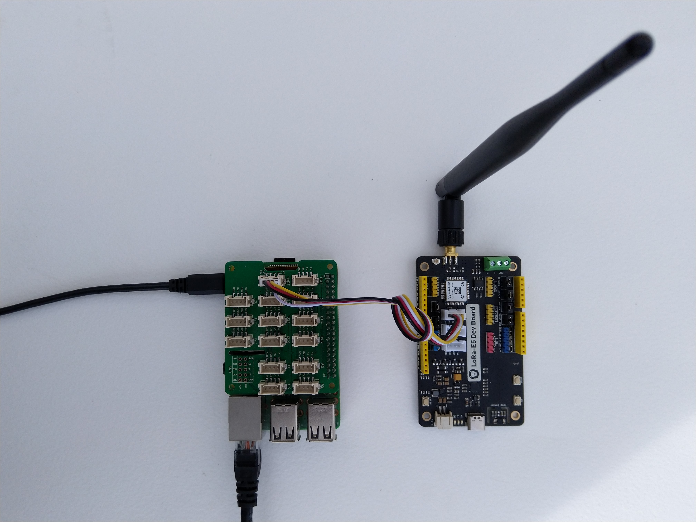
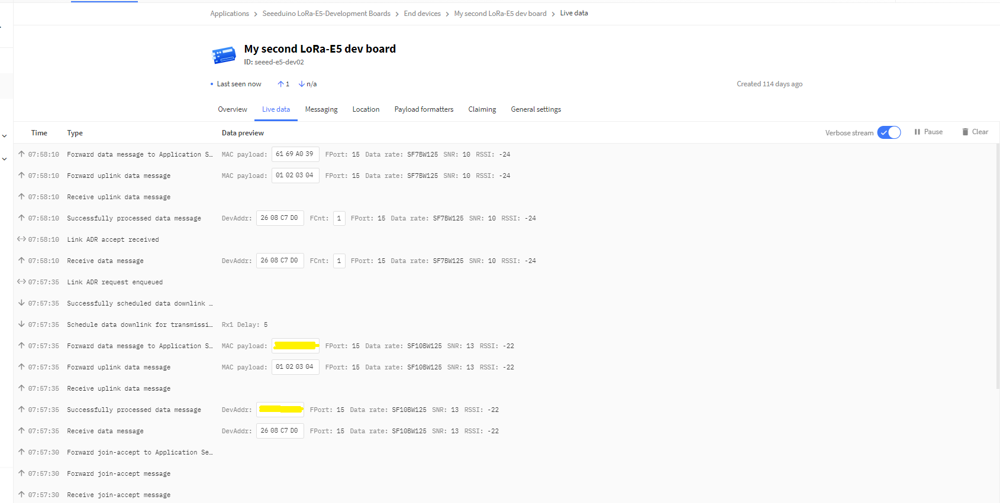

# SeeedLoRaE5-NetCore

A C# library for [LoRaWAN](https://lora-alliance.org/about-lorawan) connectivity for [Seeedstudio](https://www.seeedstudio.com/) [LoRa-E5](https://www.seeedstudio.com/LoRa-E5-Wireless-Module-p-4745.html) equipped [.Net Core 5](https://dotnet.microsoft.com/) powered devices.

This repo has the source code for the series of blog posts written as I ported my [.NET nanoFramework Seeed LoRa-E5 LoRaWAN library](https://github.com/KiwiBryn/SeeedLoRaE5LoRaWAN-NetNF) to .Net Core 5.

01. [Basic connectivity](http://blog.devmobile.co.nz/2021/09/12/net-core-seeed-lorae5-lorawan-library-part1/)
02. [Nasty OTAA connect](http://blog.devmobile.co.nz/2021/09/13/net-core-seeed-lorae5-lorawan-library-part2/)

I used a [LoRa-E5 Development Kit](https://www.seeedstudio.com/LoRa-E5-Dev-Kit-p-4868.html) and [
Grove Base Hat for Raspberry Pi](https://www.seeedstudio.com/Grove-Base-Hat-for-Raspberry-Pi.html) for development

[The Things Network](https://www.thethingsnetwork.org/) uplink and downlink messaging 

I used a local [RAK7258 WisGate Edge Lite](https://store.rakwireless.com/collections/wisgate-edge/products/rak7258-micro-gateway) connected to [The Things Network](https://www.thethingsnetwork.org/) to test my implementation.

